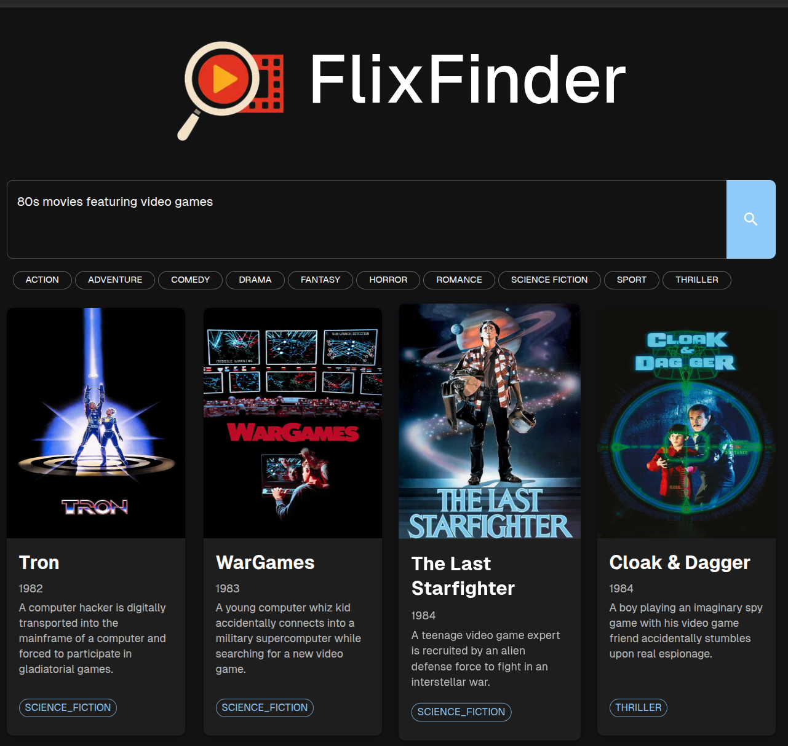

# FlixFinder

FlixFinder is a movie recommendation backend system powered by AI to help users discover films tailored to their preferences.
The application employs large language models to analyze user preferences and generate personalized movie recommendations across various genres.
It integrates with [TMDB](https://www.themoviedb.org/) to fetch more information about each LLM suggestion.

Example of a web app UI consuming FlixFinder's backend:
<p align="center">
  
</p>

## ✨ Key Features
- **AI-Powered Recommendations**: Utilizes advanced language models to understand user preferences and generate contextually relevant movie suggestions
- **User Backlog**: Save recommended movies to a personal backlog for later viewing

## 🚀 Getting Started

### Prerequisites
- API key for LLM compatible with OpenAI SDK
- API key for TMDB
- MySQL database

### Configuration
Configure your application by modifying and renaming the `application-local.yaml.template` file:
```yaml
# Database configuration
spring:
  datasource:
    url: jdbc:mysql://localhost:3306/flixfinder
    username: flixuser
    password: flixpassword

# API keys and external service configuration
tmdb:
  api-key: your_tmdb_api_key
  base-url: https://api.themoviedb.org/3

# LLM configuration
openai:
  api-key: your_gemini_api_key
  model: gemini-2.5-flash-preview-04-17
  base-url: https://generativelanguage.googleapis.com/v1beta/
```

### Running the Application
```bash
./gradlew bootRun
```
The application will be available at `http://localhost:8080`

## 🔍 API Endpoints
### User Management
- `POST /api/users`: Create a new user
  - Request body: `{ "username": "string", "email": "string" }`
- `DELETE /api/users/{id}`: Delete a user

### Movie Recommendations
- `GET /api/movies/recommendations`: Get personalized movie recommendations
  - Query parameters:
    - `preferences`: User's movie preferences in natural language
    - `genres`: Optional genres to filter by

### User Backlog
- `GET /api/backlog/{userId}`: Get the user's saved movie backlog
- `POST /api/backlog/add`: Add movies to the user's backlog
  - Request body: `{ "userId": "long", "movies": [Movie] }`
- `DELETE /api/backlog/{userId}/item/{backlogItemId}`: Remove an item from the backlog

## 🧪 Testing
```bash
./gradlew test
```

## 🛠️ Development
The project uses:
- Kotlin
- Spring Boot
- JPA/Hibernate
- MySQL
- OpenAI SDK for LLM
- TMDB API for movie data